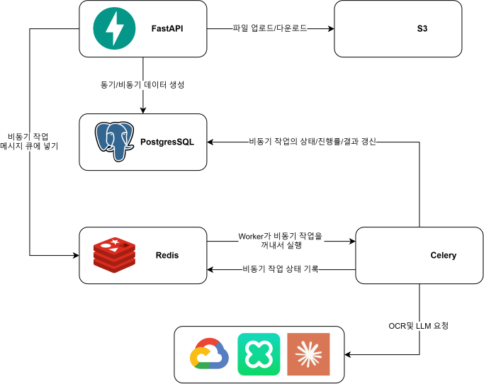

# Auto Grading Server

손글씨 시험 답안지를 OCR·LLM으로 채점하는 AI 보조 채점 백엔드입니다.
**객관식부터 서술형·코딩 문제까지** 다양한 유형을 지원하며, 답안 영역 지정부터 
OCR, 루브릭 기반 채점, 결과 통계까지 반복 작업을 자동화해 채점 시간을 절반으로 줄여줍니다.

## 주요 기능

- **다양한 문제 유형 지원** — 객관식, 서술형, 코딩 문제를 모두 채점
- **손글씨 OCR** — 스캔한 답안지에서 문제/답안 영역을 지정하면 손글씨 텍스트를 자동 인식
- **AI 자동 채점** — 정답 및 루브릭 기준에 따라 객관식·서술형·코딩 문제를 자동 채점
- **AI 루브릭 추천** — 문제 내용을 기반으로 채점 기준을 제안하고 코멘트 자동 작성
- **결과 통계 & CSV 내보내기** — 학생별·문항별 점수 분석과 결과 다운로드

## 기술 스택

| 영역 | 사용 기술 |
|---|---|
| Web | FastAPI, Uvicorn |
| ORM / Migration | SQLAlchemy 2.0 (`Mapped` 스타일), Alembic |
| Database | PostgreSQL 16 |
| Async Jobs | Celery 5 + Redis (broker / result backend) |
| Storage | S3 / 로컬 파일시스템 (Presigned URL, 클라이언트 직접 업로드) |
| OCR | Google Document AI, Naver CLOVA OCR |
| LLM | Anthropic Claude (루브릭 추천·서술형 채점) |
| PDF | PyMuPDF / pypdf (답안지 렌더링·영역 크롭) |
| Auth | JWT (python-jose), bcrypt |
| Observability | Prometheus, Loki, Grafana Alloy, Grafana |

## 시스템 아키텍처



### 레이어 구조

단방향 흐름만 허용합니다: **Router → Service → Repository → DB**

- **Router (`api/`)**: 요청 수신 + `ApiResponse[T]` 래핑만 담당. 비즈니스 로직·DB 직접 접근 금지
- **Service (`services/`)**: 비즈니스 로직, 권한 검증, 스키마 변환
- **Repository (`repositories/`)**: DB 쿼리 전용
- **Worker (`workers/`)**: 장시간 작업을 Celery task로 비동기 처리

### 비동기 Job 흐름

OCR·LLM 채점은 장시간이 소요되므로 Celery로 비동기 처리합니다.

```
1. idempotency_key 로 중복 요청 차단
2. Job 레코드 생성 (status=PENDING)
3. Celery task 호출 (.delay(job_id))
4. 202 + JobStartedResponse(job_id, status) 즉시 반환

Worker:  PENDING → RUNNING → DONE
                            → FAILED
```

Job 레코드는 `input_json` / `progress_json` / `result_json` / `error_json` 4개의 JSON 필드로
입력·진행률·결과·오류를 추적하며, 진행률은 10% 단위로만 커밋합니다.
클라이언트는 `GET /api/v1/jobs/{job_id}` 로 상태를 폴링합니다.

## 프로젝트 구조

```
auto-grading-server/
├─ app/
│  ├─ api/v1/
│  │  ├─ endpoints/      # 도메인별 라우터 (exam, problem, rubric, grade ...)
│  │  └─ router.py       # v1 라우터 집약
│  ├─ core/             # 설정, 보안, 예외, 로깅, 메트릭
│  ├─ db/               # 세션, Base, 모델 레지스트리(models.py)
│  ├─ models/           # SQLAlchemy 모델 (도메인별 파일)
│  ├─ schemas/          # Pydantic 요청/응답 DTO
│  ├─ repositories/     # DB 쿼리 계층
│  ├─ services/         # 비즈니스 로직
│  ├─ infrastructure/   # 외부 연동
│  │  ├─ ocr/           # Google Document AI · Naver CLOVA 클라이언트
│  │  ├─ storage/       # S3 · 로컬 스토리지 (Presigned URL)
│  │  └─ pdf/           # PDF 렌더링
│  ├─ workers/          # Celery task (ocr/rubric/grade/region) + tasks.py
│  ├─ enums/            # Enum 정의
│  └─ main.py           # FastAPI 앱 엔트리포인트
├─ alembic/             # DB 마이그레이션
├─ monitoring/          # Prometheus / Loki / Alloy / Grafana 설정
├─ scripts/             # 운영 스크립트
├─ tests/
├─ docker-compose.yml   # 앱 + DB + Redis + 모니터링 스택
└─ requirements.txt
```

## 채점 파이프라인 (0~7단계)

| 단계 | 내용 |
|---|---|
| 0 | 대시보드 & 시험 CRUD |
| 1 | 문제지 세팅 — 문제 영역 지정 + 모범답안 OCR |
| 2 | 루브릭 설정 — LLM 추천 + 수동 편집 |
| 3 | 학생 정보 입력 & 답안지 업로드 + 학생 식별 OCR |
| 4 | 답안 영역 지정 (FIXED / FREE 레이아웃) |
| 5 | 답안 OCR 및 확인 |
| 6 | 채점 및 확정 (문제 유형에 따라 자동/LLM 분기, 수동 보정) |
| 7 | 성적 검토 & CSV Export |

## 시작하기

앱, PostgreSQL, Redis, 모니터링 스택을 한 번에 기동합니다.

```powershell
cp .env.example .env

docker compose up -d --build
```

> Compose가 `.env` 를 자동으로 읽어 변수를 치환합니다.

| 서비스 | 주소 |
|---|---|
| API | http://localhost:8000 |
| Swagger UI | http://localhost:8000/docs |
| Health check | http://localhost:8000/health |
| Metrics | http://localhost:8000/metrics |
| Grafana | http://localhost:3000 (admin) |
| Prometheus | http://localhost:9090 |

### DB 마이그레이션

```bash
alembic upgrade head
```

## 개발 컨벤션

코딩 컨벤션은 [`CLAUDE.md`](CLAUDE.md)와 [`.claude/rules/`](.claude/rules/) 에 도메인별로
정리되어 있습니다 (레이어 분리, 네이밍, 예외 처리, Celery 워커, docstring 규약 등).

- 포맷터 **black**, 린터 **ruff** — 커밋 전 통과 필수
- 함수/변수: `snake_case`, 클래스: `PascalCase`
- 모든 응답은 `ApiResponse[T]` 래퍼로 반환
- 비즈니스 예외는 `app/core/exceptions.py` 정의 + `main.py` 핸들러 등록
